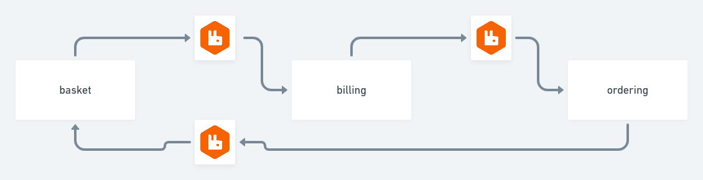

Testing SLO with a focus on the user journey across different microservices

## Result:

### async vs sync

# Lessons learnt

Always send a timestamp at the start of the journey

# Install

    $ make install

# Run

    $ make up

# Test

    $ make loadtest
